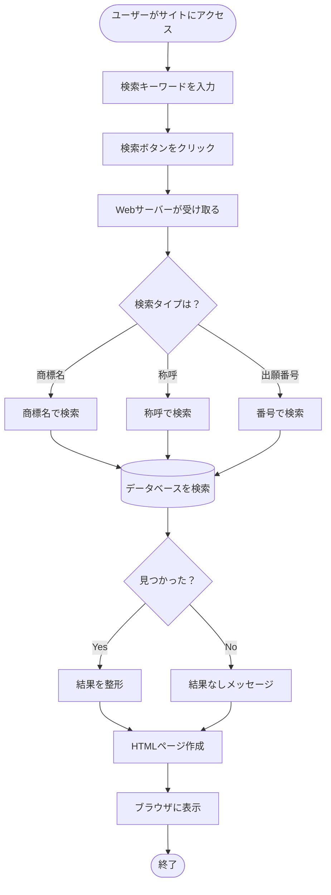

# 🔍 TMCloud検索システムを理解しよう！
～中学生のためのプログラミング学習教材～

## 📚 目次
1. [はじめに - プログラムって何？](#1-はじめに)
2. [TMCloudシステムの全体像](#2-システムの全体像)
3. [データベースという本棚](#3-データベース)
4. [検索の仕組み](#4-検索の仕組み)
5. [Webサーバーの役割](#5-webサーバー)
6. [実際のコードを見てみよう](#6-実際のコード)
7. [プログラムの流れ（フローチャート）](#7-フローチャート)
8. [まとめとチャレンジ問題](#8-まとめ)

---

## 1. はじめに - プログラムって何？ 🤔

プログラムは「**コンピュータへの指示書**」です。
料理のレシピのように、順番に何をすればいいかを書いたものです。

### TMCloudは何をするプログラム？
商標（会社や商品の名前・ロゴ）を検索するシステムです。
例えば「ポケモン」や「プレイステーション」などの商標を探せます。

---

## 2. システムの全体像 🏗️

TMCloudは大きく3つの部品でできています：

```
┌─────────────────────────────────────────────┐
│                  あなたのブラウザ              │
│        （Chrome, Safari, Edgeなど）           │
└────────────────┬────────────────────────────┘
                 │ ①検索リクエスト
                 │ 「プルという名前を探して！」
                 ↓
┌─────────────────────────────────────────────┐
│              Webサーバー                      │
│         (tmcloud_simple_web.py)              │
│    「受付窓口」の役割をするプログラム            │
└────────────────┬────────────────────────────┘
                 │ ②データベースに問い合わせ
                 ↓
┌─────────────────────────────────────────────┐
│            検索エンジン                        │
│     (tmcloud_search_integrated.py)           │
│     「図書館の司書」の役割をするプログラム        │
└────────────────┬────────────────────────────┘
                 │ ③データを探す
                 ↓
┌─────────────────────────────────────────────┐
│             データベース                       │
│          (tmcloud_v2.db)                     │
│      「本棚」商標データが保存されている          │
└─────────────────────────────────────────────┘
```

### 🎯 例え話で理解しよう！

図書館で本を探すときを想像してください：
1. **あなた（ブラウザ）** が受付に行く
2. **受付の人（Webサーバー）** が要望を聞く
3. **司書さん（検索エンジン）** が本を探す
4. **本棚（データベース）** から本を取り出す
5. 見つかった本の情報を返す

---

## 3. データベースという本棚 📚

### データベースとは？
たくさんの情報を整理して保存する「デジタルな本棚」です。

### TMCloudのデータベース構造

```
商標データベース（tmcloud_v2.db）
├── 📁 trademark_case_info（商標の基本情報）
│   ├── 出願番号（ID番号みたいなもの）
│   ├── 商標名（ブランド名）
│   ├── 出願日（いつ申請したか）
│   └── その他の情報
│
├── 📁 trademark_phonetics（読み方）
│   ├── 出願番号
│   └── カタカナの読み方
│
├── 📁 trademark_applicants_agents（申請した人）
│   ├── 出願番号
│   ├── 申請者の名前
│   └── 住所
│
└── 📁 その他40個のテーブル...
```

### 💡 ポイント
- 1つの商標には「出願番号」という**学生番号のようなID**がある
- このIDで全ての情報をつなげている

---

## 4. 検索の仕組み 🔍

### 検索の種類

TMCloudでは6種類の検索ができます：

| 検索タイプ | 説明 | 例 |
|---------|------|-----|
| 商標名検索 | ブランド名で探す | 「プル」を含む商標 |
| 称呼検索 | 読み方で探す | 「プル」と読む商標 |
| 出願番号検索 | ID番号で探す | 2025064118 |
| 出願人検索 | 会社名で探す | 任天堂株式会社 |
| 国際登録番号 | 国際的なID | 1858710 |
| 拒絶理由検索 | 却下された理由 | 3条1項 |

### 検索の流れ（商標名検索の例）

```python
# ユーザーが「プル」と入力したとき

1. 入力を正規化（きれいにする）
   "プル" → "プル"（全角に統一）

2. SQLという言語でデータベースに質問
   SELECT * FROM trademark_search 
   WHERE search_use_t_norm LIKE '%プル%'
   （「プル」を含む商標を全部探して！）

3. 結果を整理
   見つかった商標の情報を取り出す

4. 表示用に整形
   Webページで見やすくする
```

---

## 5. Webサーバーの役割 🌐

### Webサーバーとは？
インターネット上の「**受付窓口**」です。

### tmcloud_simple_web.pyの仕事

```
┌──────────────────────────┐
│   ブラウザからのリクエスト   │
│  「プルで検索して！」        │
└────────────┬─────────────┘
            ↓
    [1. リクエストを受け取る]
            ↓
    [2. 検索タイプを判断]
    ・商標名検索？
    ・称呼検索？
    ・その他？
            ↓
    [3. 検索エンジンに依頼]
            ↓
    [4. 結果を受け取る]
            ↓
    [5. HTMLページを作る]
            ↓
┌──────────────────────────┐
│   ブラウザに結果を返す      │
│  「3件見つかりました！」     │
└──────────────────────────┘
```

### HTMLって何？
Webページを作る言語です。以下のような形式：

```html
<h2>検索結果</h2>
<div class="result">
    <strong>商標名:</strong> プルーフ<br>
    <strong>出願番号:</strong> 2025064118<br>
    <strong>出願日:</strong> 2025年7月25日
</div>
```

---

## 6. 実際のコードを見てみよう 💻

### 簡単な検索機能のコード

```python
# これは簡略化したコードです

class TMCloudSearch:
    def __init__(self, database_path):
        """初期化（準備）する関数"""
        self.conn = sqlite3.connect(database_path)
        print("データベースに接続しました！")
    
    def search_by_name(self, keyword):
        """商標名で検索する関数"""
        # SQLで質問を作る
        query = f"SELECT * FROM trademarks WHERE name LIKE '%{keyword}%'"
        
        # データベースに質問する
        cursor = self.conn.cursor()
        cursor.execute(query)
        
        # 結果を取得
        results = cursor.fetchall()
        
        # 結果を返す
        return results

# 使い方
searcher = TMCloudSearch("database.db")
results = searcher.search_by_name("プル")
print(f"{len(results)}件見つかりました！")
```

### コードの説明
1. **class（クラス）**: 機能をまとめた箱
2. **def（関数）**: 特定の仕事をする部品
3. **self**: 自分自身を指す言葉
4. **return**: 結果を返す

---

## 7. フローチャート 📊

### 全体の処理の流れ



### 検索処理の詳細フローチャート

```
開始
  ↓
[キーワード入力]
  ↓
<前処理>
・空白を削除
・全角/半角を統一
・特殊文字をエスケープ
  ↓
<データベース検索>
・SQL文を作成
・実行
・結果取得
  ↓
<結果処理>
・データを整理
・関連情報を追加
  ↓
[結果表示]
  ↓
終了
```

---

## 8. まとめとチャレンジ問題 🎯

### 学んだこと
1. **プログラム**は順番に処理を実行する指示書
2. **データベース**は情報を整理して保存する場所
3. **Webサーバー**はブラウザとデータベースの橋渡し
4. **検索エンジン**は効率的にデータを探す仕組み

### チャレンジ問題

#### 🔰 初級問題
1. データベースの中で、商標の「読み方」を保存するテーブルは何？
2. 「プル」で検索したとき、最初に行われる処理は何？

#### 🔥 中級問題
1. なぜ出願番号（ID）が必要なのか説明してください
2. HTMLとは何か、自分の言葉で説明してください

#### ⚡ 上級問題
1. 以下のSQLは何を検索していますか？
```sql
SELECT * FROM trademark_case_info 
WHERE app_date >= '20250101' 
AND app_date <= '20251231'
```

2. 新しい検索機能「色で検索」を追加するには、どんな処理が必要でしょうか？

### 答え

<details>
<summary>初級問題の答え</summary>

1. trademark_phonetics（商標称呼テーブル）
2. 入力の正規化（全角/半角の統一など）

</details>

<details>
<summary>中級問題の答え</summary>

1. 出願番号は各商標を区別するための唯一のIDで、これがあることで同じ名前の商標でも区別でき、また複数のテーブルの情報を結びつけることができる
2. HTMLはWebページを作るための言語で、文字の大きさや色、配置などを指定できる設計図のようなもの

</details>

<details>
<summary>上級問題の答え</summary>

1. 2025年1月1日から2025年12月31日までに出願された商標を全て検索している
2. 必要な処理：
   - データベースに色情報を保存するテーブルを追加
   - 色で検索する関数を作成
   - Webインターフェースに色選択機能を追加
   - 検索結果に色情報を表示する機能を追加

</details>

---

## 🚀 次のステップ

このシステムをより理解したい場合は：

1. **Python**の基礎を学ぶ
2. **SQL**（データベース言語）を学ぶ
3. **HTML/CSS**（Web制作）を学ぶ
4. 実際にコードを書いて動かしてみる

### 参考になるサイト
- [Python公式チュートリアル](https://docs.python.org/ja/3/tutorial/)
- [SQLiteチュートリアル](https://www.sqlitetutorial.net/)
- [MDN Web Docs](https://developer.mozilla.org/ja/)

---

## 付録：用語集 📖

| 用語 | 説明 |
|-----|------|
| **プログラム** | コンピュータへの指示書 |
| **データベース** | データを整理して保存する仕組み |
| **SQL** | データベースと話すための言語 |
| **HTML** | Webページを作る言語 |
| **サーバー** | サービスを提供するコンピュータ |
| **クライアント** | サービスを使う側（ブラウザなど） |
| **API** | プログラム同士が話すための窓口 |
| **関数** | 特定の仕事をする部品 |
| **変数** | データを入れる箱 |
| **ループ** | 繰り返し処理 |

---

🎉 **おめでとう！** TMCloudシステムの基本を理解できました！
プログラミングは練習すれば必ず上達します。がんばって！